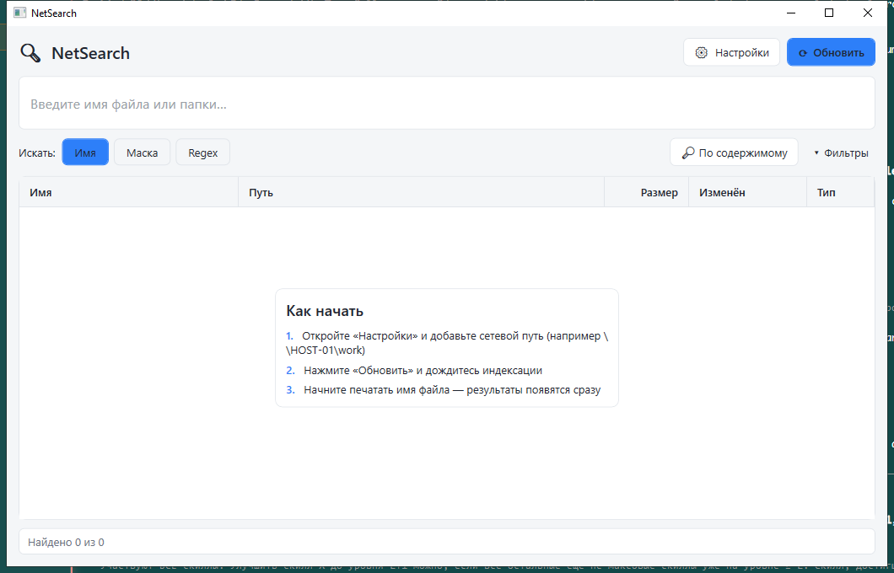

# NetSearch

[](https://github.com/denfry/NetSearch/actions/workflows/ci.yml)
[](https://github.com/denfry/NetSearch/releases/latest)
[](https://github.com/denfry/NetSearch/releases)
[](LICENSE)

Быстрый поиск файлов и папок по сетевым (SMB) дискам — аналог WizFile для
Windows. NetSearch индексирует заданные сетевые пути в локальную базу SQLite и
ищет мгновенно: по имени (подстрока, маски `*?`, regex), с фильтрами по
размеру, дате и типу, а также поиском по содержимому в текущей выборке.



## Возможности

- **Мгновенный поиск** по имени из локального индекса — результаты по мере ввода.
- **Три режима:** подстрока, маска (`*.pdf`, `отчёт_??.xlsx`) и регулярные выражения.
- **Фильтры:** размер (КБ/МБ/ГБ), диапазон дат изменения, тип/расширения,
  быстрые кнопки PDF / Word / Excel / Фото, только файлы или только папки.
- **Поиск по содержимому** внутри уже найденных по имени файлов.
- **Авто-обновление** индекса по заданному интервалу.
- **Один файл** — портативный self-contained `.exe`, без установки и без .NET в системе.

## Установка

Скачайте последний `NetSearch.exe` со страницы
[Releases](https://github.com/denfry/NetSearch/releases/latest) и запустите —
установка не требуется.

> Требования: Windows 10/11 (x64). Среда выполнения .NET встроена в `.exe`.

## Использование

1. Запустите `NetSearch.exe`.
2. **Настройки** → добавьте сетевые пути (например `\\HOST-01\work` или `Z:\`,
   по одному на строку) и при желании задайте интервал авто-обновления.
3. **Обновить** — постройте индекс (первый раз дольше).
4. Печатайте в строке поиска — список фильтруется мгновенно. Переключайте режим
   (Имя / Маска / Regex) и раскрывайте **Фильтры** для уточнения.

Правый клик по строке: открыть файл, открыть папку, скопировать путь.

Индекс и настройки хранятся в `%LOCALAPPDATA%\NetSearch\`.

## Сборка из исходников

Требуется [.NET SDK 9](https://dotnet.microsoft.com/download).

```bash
dotnet build          # сборка
dotnet test           # тесты
pwsh ./publish.ps1    # портативный publish/NetSearch.exe
```

## Стек

- .NET 9 · WPF (`net9.0-windows`)
- MVVM на [CommunityToolkit.Mvvm](https://github.com/CommunityToolkit/dotnet)
- Хранилище индекса — SQLite

Логика поиска и индексации вынесена в библиотеку `NetSearch.Core` и покрыта
тестами (`tests/NetSearch.Core.Tests`); UI — в `NetSearch.App`.

## Вклад

Баги и предложения — через [Issues](https://github.com/denfry/NetSearch/issues).
Перед PR см. [CONTRIBUTING.md](CONTRIBUTING.md).

## Лицензия

[MIT](LICENSE) © denfry
